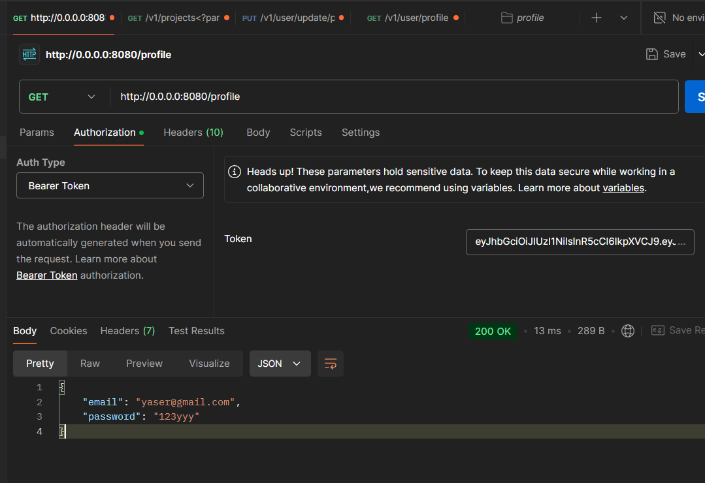

## API Lab

## Overview 📖
We are supposed to build an api with some endpoints and routes.

## Routes
- Home `/`
- Login `/login`
- Movies `/movies`
- Profile `/profile`

## Results

#### Home Route

#### Login Route

#### Movies Route

#### Profile Route

## Conclusion
This lab increased my knowledge in backend development and improved my skills.